# Screenshots

All images below are **real, current screenshots** captured from the running
Razor Pages app (`dotnet-razor/HoaiKhoi_SE1950_A02`). Authenticated pages were
captured by actually logging in as the admin and as a lecturer. Images live in
`docs/images/`.

> **How these were captured — honest note on tooling.** A dedicated *Chrome
> DevTools MCP server* is **not connected** in this environment, so screenshots
> were taken by driving the installed **Google Chrome over the Chrome DevTools
> Protocol (CDP)** — the same protocol Chrome DevTools MCP uses under the hood —
> via a headless Playwright (`playwright-core`) script against the live app
> (`dotnet run`). No screenshot is faked, mocked, or reused from a placeholder.

## Index

| Screenshot | Role / page | What it shows |
| --- | --- | --- |
| `login.png` | anonymous · `/Auth/Login` | Default start page (session login form) |
| `admin-dashboard.png` | Admin · `/Admin/Index` | Dashboard with course/account counts |
| `admin-courses.png` | Admin · `/Courses/Index` | Course management list + search |
| `create-course-modal.png` | Admin · `/Courses/Index` | Create-course Bootstrap modal (filled) |
| `account-management.png` | Admin · `/Accounts/Index` | Account list with role/course/status + filters |
| `create-teacher-account.png` | Admin · `/Accounts/Index` | Create-teacher modal with assigned course |
| `teacher-dashboard.png` | Teacher · `/Teacher/Index` | Lecturer dashboard cards |
| `teacher-live-courses.png` | Teacher · `/Teacher/Courses` | SignalR live course catalogue |
| `teacher-upload-document.png` | Teacher · `/Documents/Upload` | Upload + index form |
| `teacher-documents.png` | Teacher · `/Documents/Index` | "My Documents" with index status |
| `chat-rag-picker.png` | Teacher/Student · `/Chat/Index` | Indexed-document picker for RAG |
| `chat-rag-ask.png` | Teacher/Student · `/Chat/Ask` | Ask-a-question form (answer renders inline) |
| `signalr-live-update.png` | Teacher · `/Teacher/Courses` | **Proof** of live update (see below) |
| `email-teacher-welcome.png` | — | Rendered lecturer onboarding HTML email |

## Authentication

### Login (default start page)
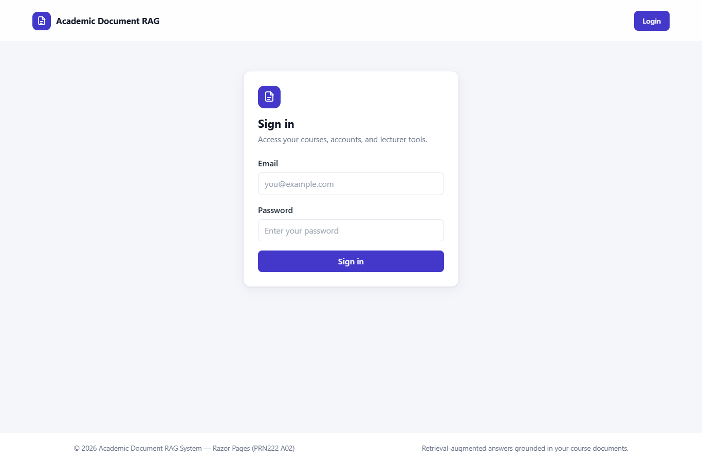

## Admin

### Admin dashboard
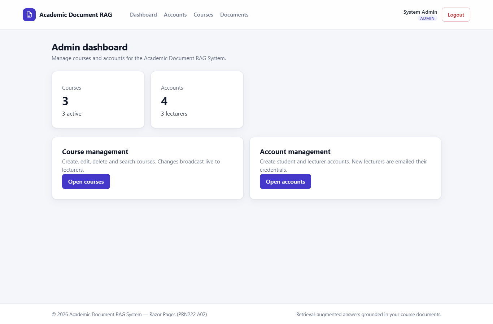

### Course management
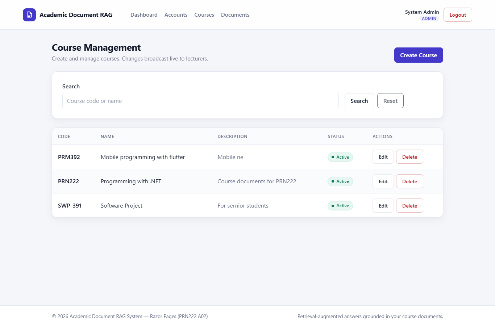

### Create course (modal)
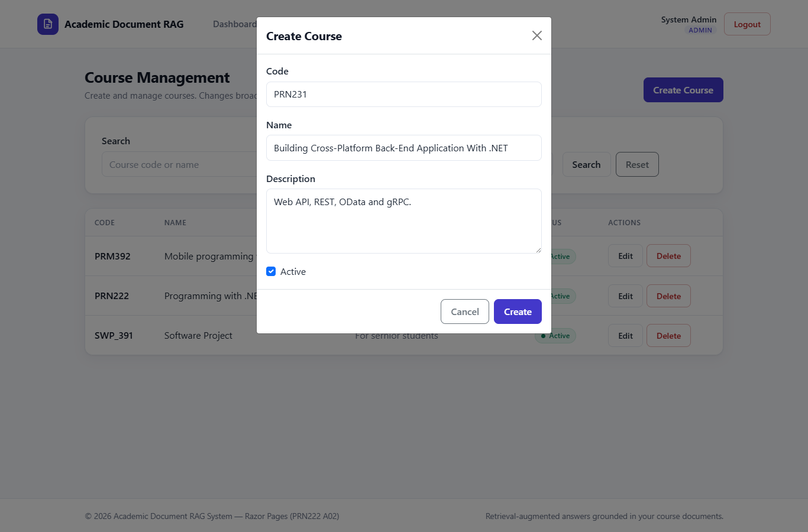

### Account management
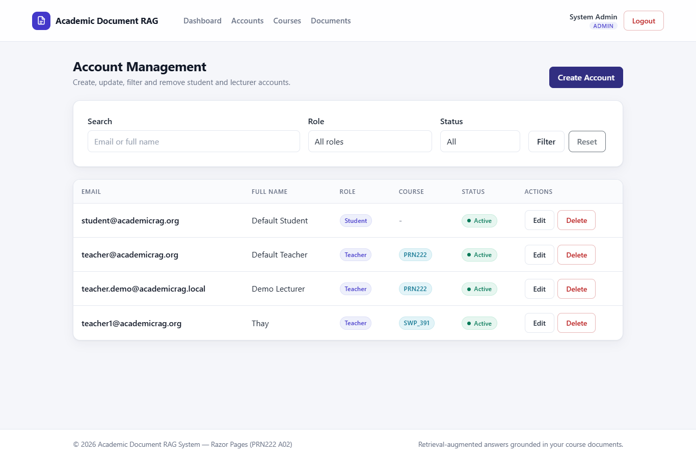

### Create teacher/lecturer account (modal)
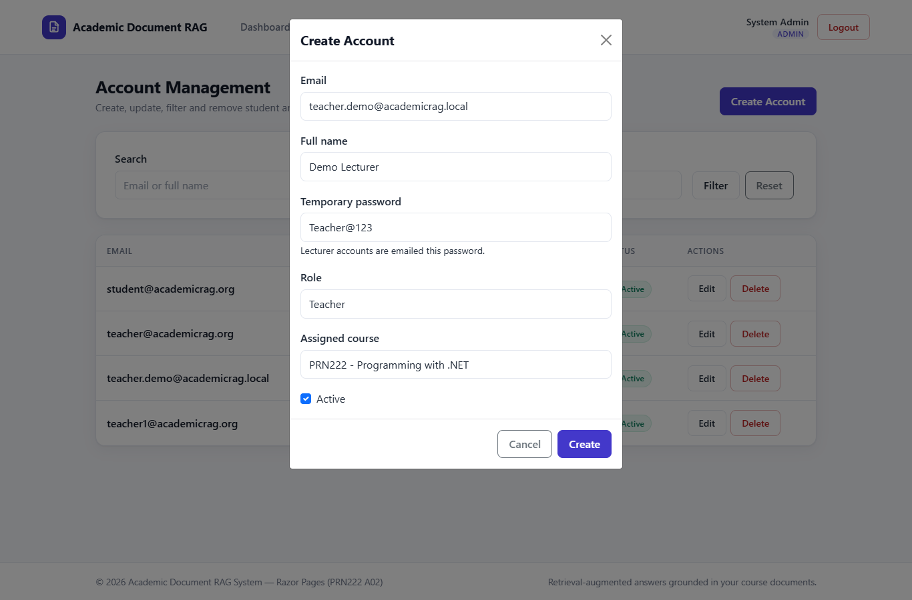

## Teacher / Lecturer

### Lecturer dashboard
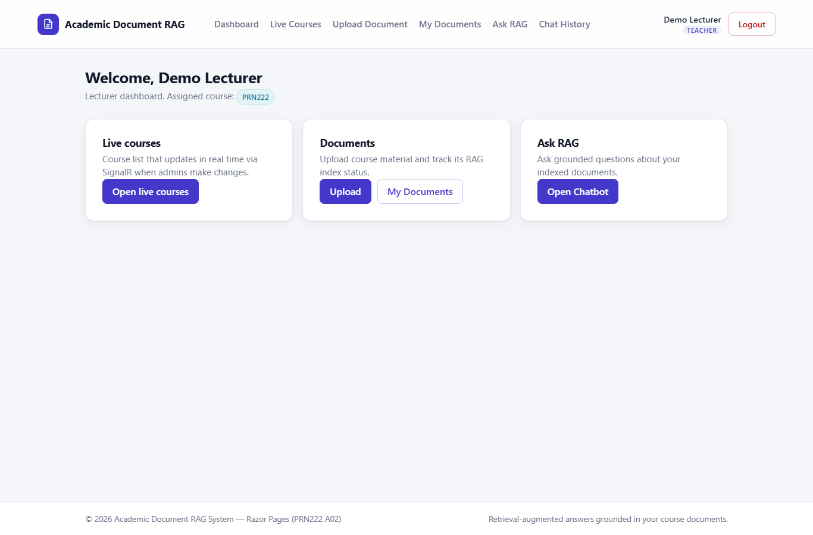

### Live courses (SignalR)
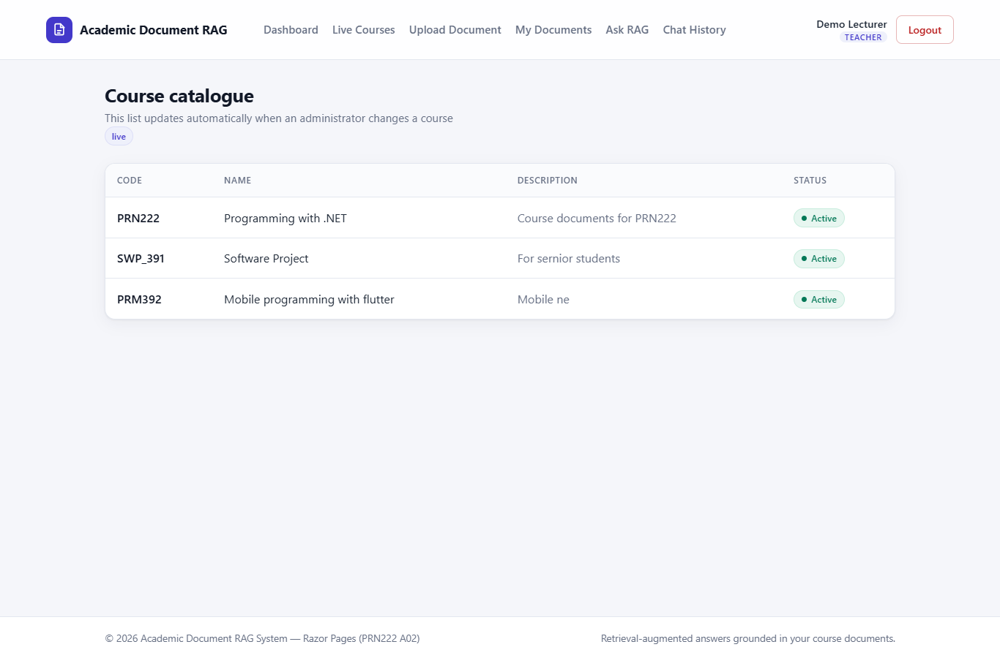

### Upload document
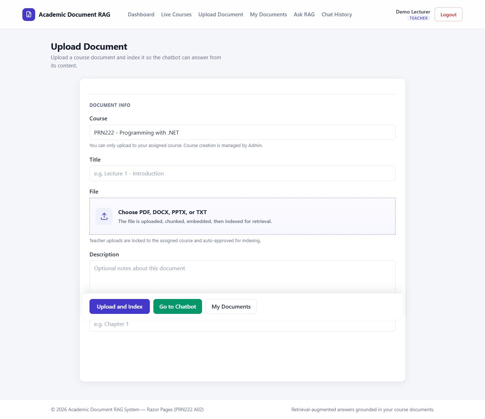

### My documents
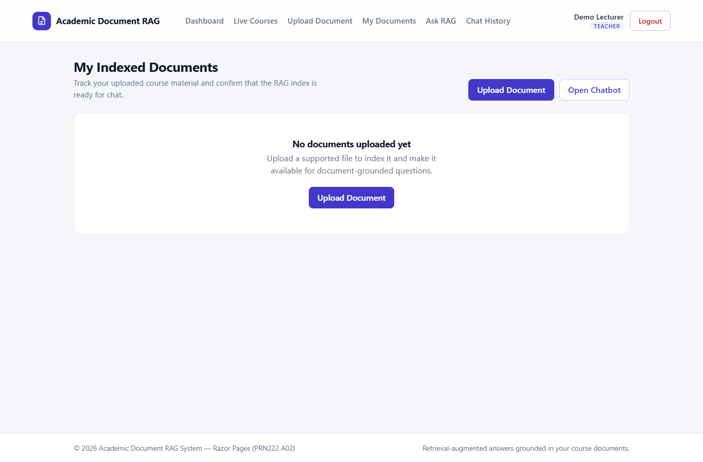

## RAG / Chat

### Ask the RAG chatbot — document picker
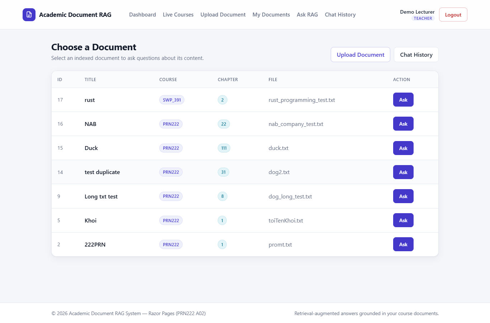

### Ask a question
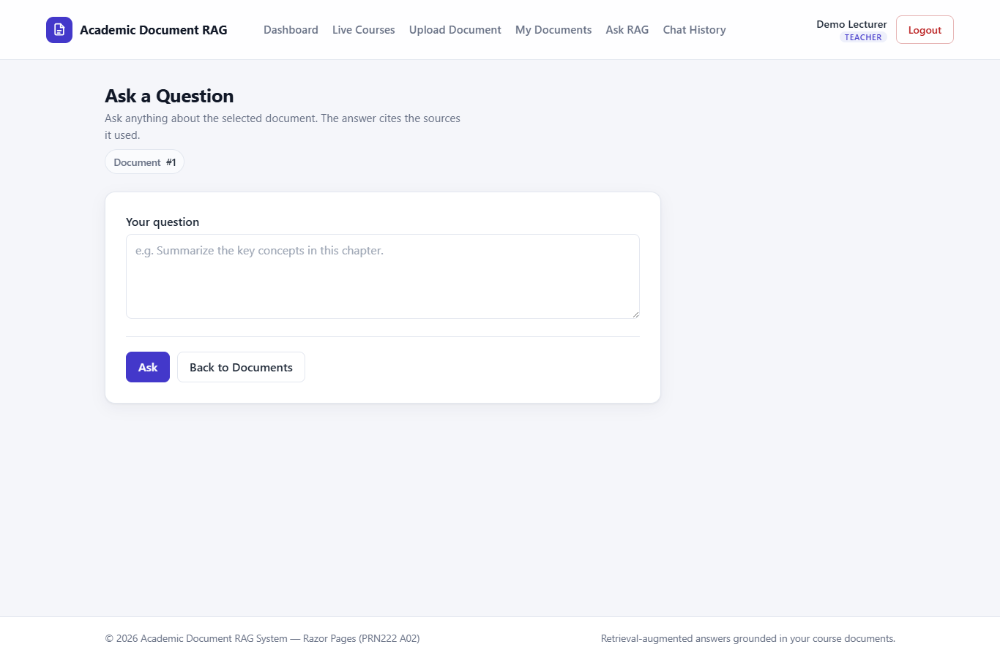

## SignalR — live update proof

This frame was captured on the lecturer's `/Teacher/Courses` page **after** an
admin created a course named *"Created live via SignalR — no page refresh"* (code
`RTLIVE`) in a **separate** browser context. The new row is visible on the
lecturer page even though that page was **never reloaded** — the row was pushed
over the `CourseHub` and the table fragment was swapped in by
`course-realtime.js`. The capture script confirmed `signalr live update
observed: true` before taking the screenshot, and the demo course was deleted
afterward as cleanup.

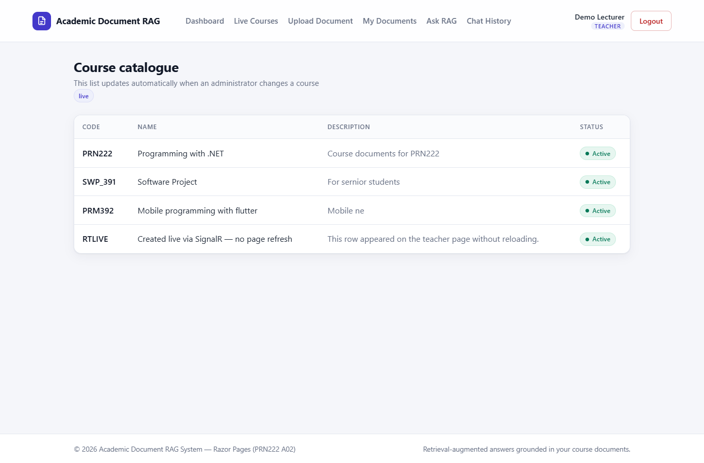

## SMTP — rendered onboarding email

Rendered from the actual `TeacherWelcome.html` template (the embedded resource
used by `EmailTemplateRenderer`) with sample values.

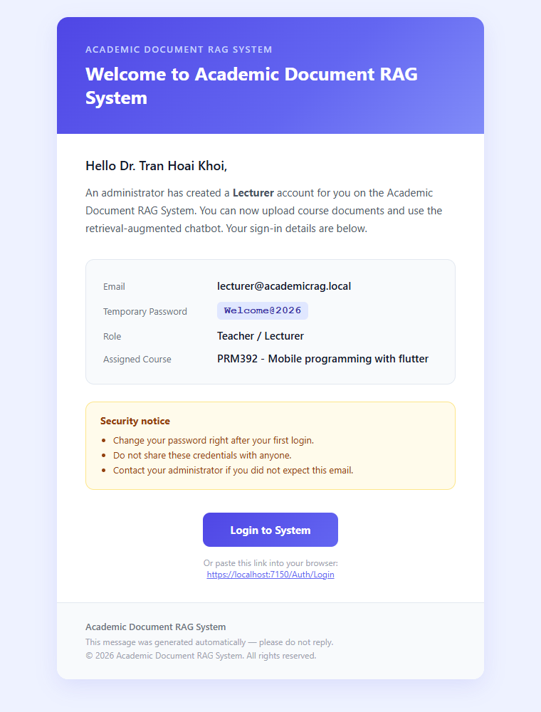

## Honest limitations / skipped captures

* **Live Gmail/Outlook inbox screenshot of the email was not captured**, because
  no real SMTP credentials are configured in this repo (placeholders only). The
  rendered local HTML email preview was captured instead — it is the exact markup
  that would be delivered. Configure SMTP per [`smtp.md`](smtp.md) to send for real.
* **`teacher-documents.png` shows the empty state** ("no documents yet") because
  uploading + indexing a document requires the Python `rag-service` to be running,
  which was not started during capture. The page itself (layout, summary cards,
  table headers) renders fully.
* **`chat-rag-ask.png` shows the question form** (not a generated answer) for the
  same reason — a real answer requires the RAG service online and an indexed
  document. With the service offline the page shows a graceful error rather than
  crashing; the form and inline-answer area are real.
